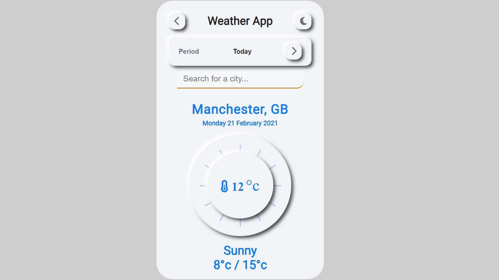

# Weatherly 🌤️

**Weatherly** is a responsive weather application that provides real-time weather information for any city. Built with HTML, CSS, and JavaScript, it integrates the OpenWeatherMap API to fetch and display the current weather, including temperature, weather conditions, and daily high/low temperatures. The app also features a light/dark mode toggle and a modern neumorphism-inspired user interface.

## Features
- **Real-time Weather Data**: Fetches live weather information using the OpenWeatherMap API.
- **Search Functionality**: Allows users to search for weather updates by city name.
- **Light/Dark Mode**: Users can switch between light and dark themes.
- **Responsive Design**: The layout adjusts smoothly across different screen sizes.
- **Neumorphic UI**: Features a sleek and modern design with soft shadows and rounded edges.

## Demo


## Getting Started

### Prerequisites
- A basic understanding of HTML, CSS, and JavaScript.
- An API key from [OpenWeatherMap](https://openweathermap.org/).

### Installation

1. Clone the repository:
   ```bash
   git clone https://github.com/yourusername/weatherly.git
   ```

2. Navigate to the project directory:
   ```bash
   cd weatherly
   ```

3. Open the `index.html` file in your browser:
   ```bash
   open index.html
   ```

4. Add your OpenWeatherMap API key in the `index.js` file:
   ```javascript
   const api = {
       key: "YOUR_API_KEY",
       base: "https://api.openweathermap.org/data/2.5/"
   }
   ```

### Usage

- Enter a city name in the search box to get the current weather data.
- Toggle between light and dark themes by clicking the moon button in the header.

## Technologies Used
- **HTML5**
- **CSS3 (with Neumorphic Design)**
- **JavaScript (ES6+)**
- **OpenWeatherMap API**
- **Font Awesome Icons**
- **Google Fonts**

## Project Structure
```
weatherly/
│
├── index.html           # The main HTML file
├── style.css            # Custom styles and theme definitions
├── index.js             # JavaScript functionality, including API requests, Theme toggle and UI interactions
├── README.md            # Project documentation
└── assets/              # Folder for images and icons
```

## Future Improvements
- Add hourly and weekly weather forecasts.
- Implement geolocation to automatically fetch weather for the user's current location.
- Add unit toggle (°C/°F).

## License
This project is licensed under the MIT License.

